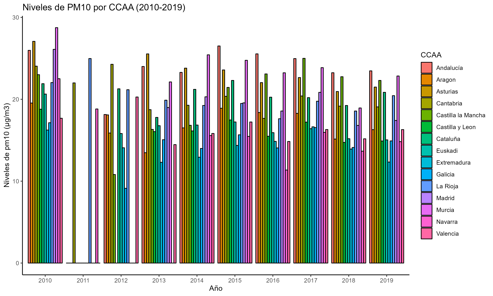
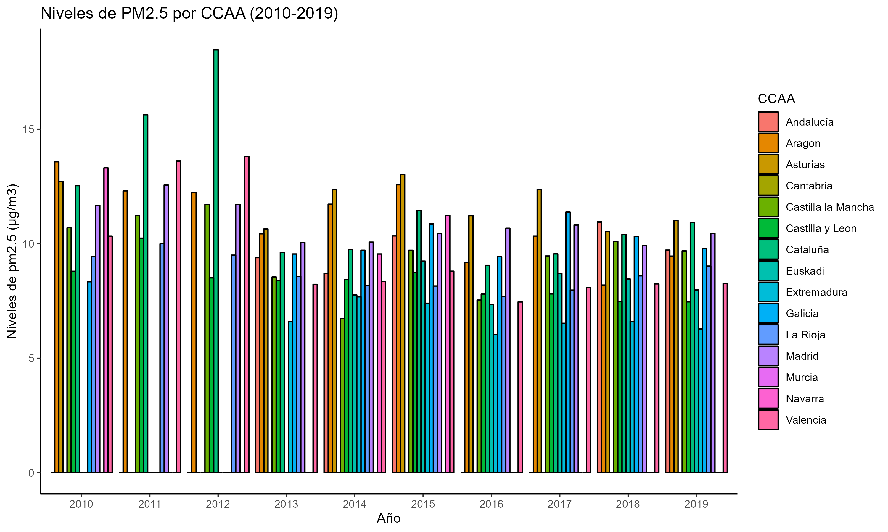
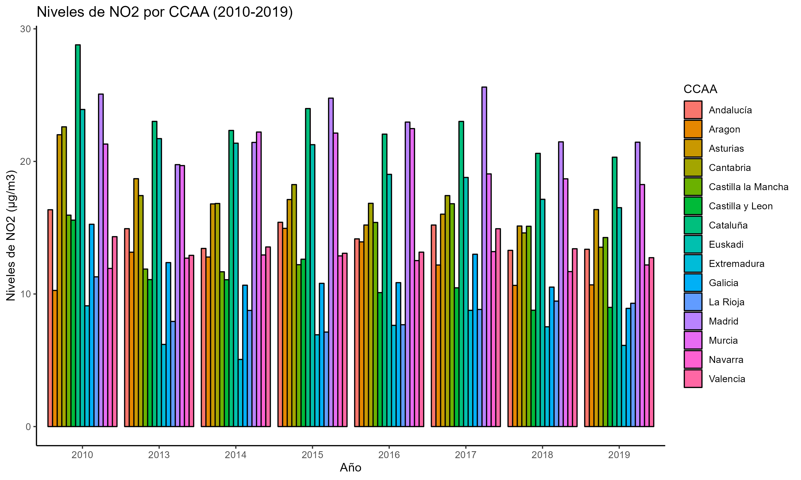
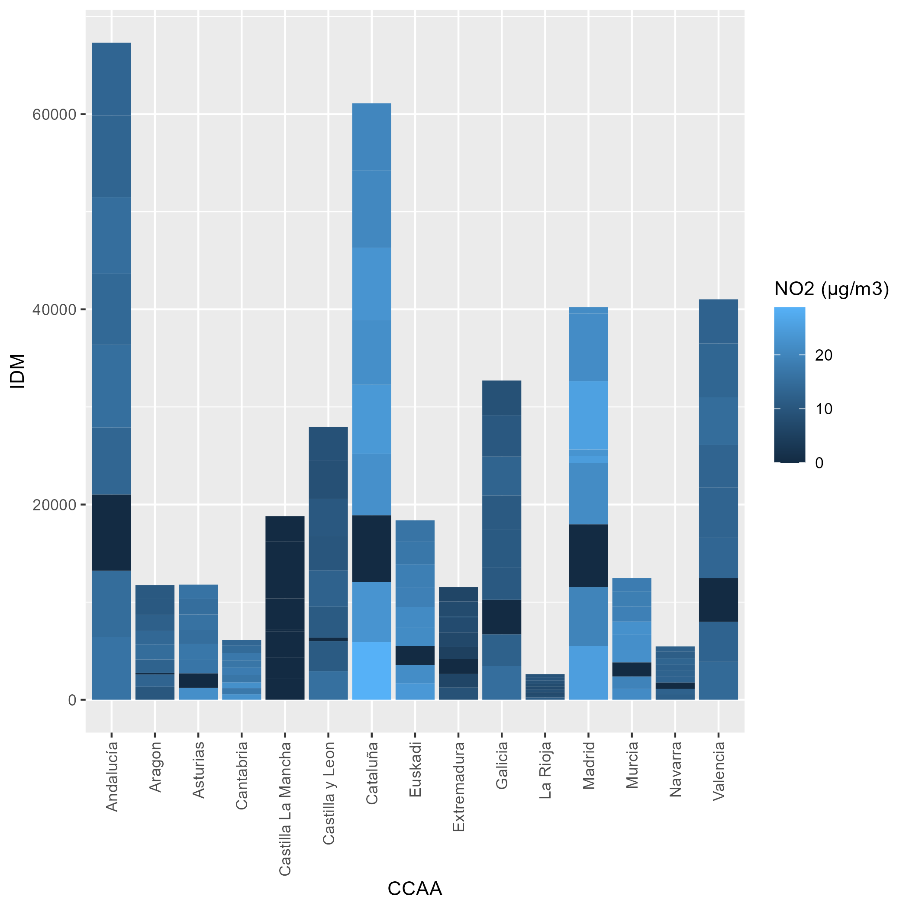
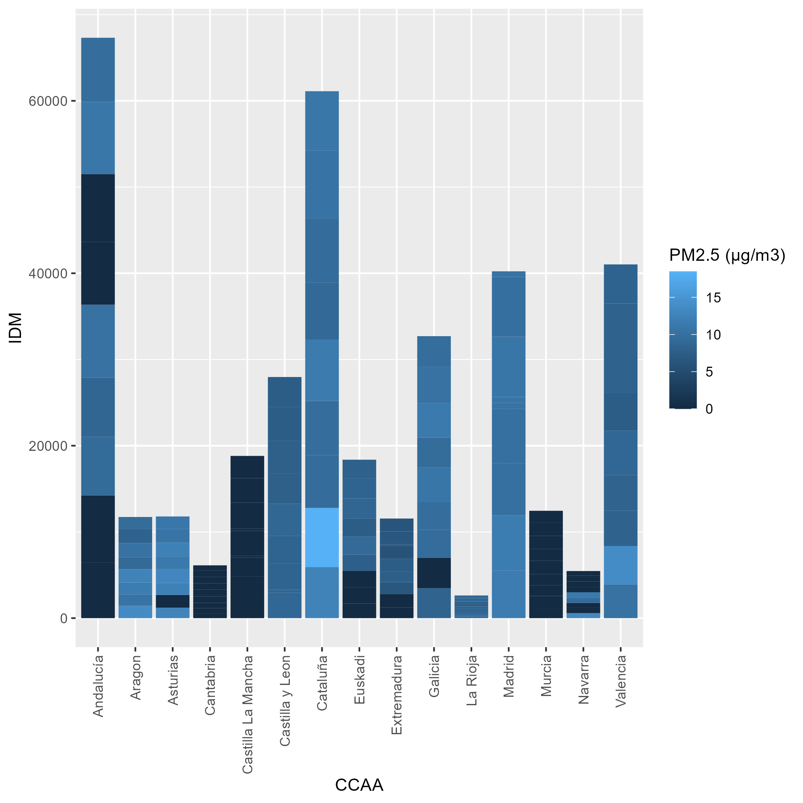
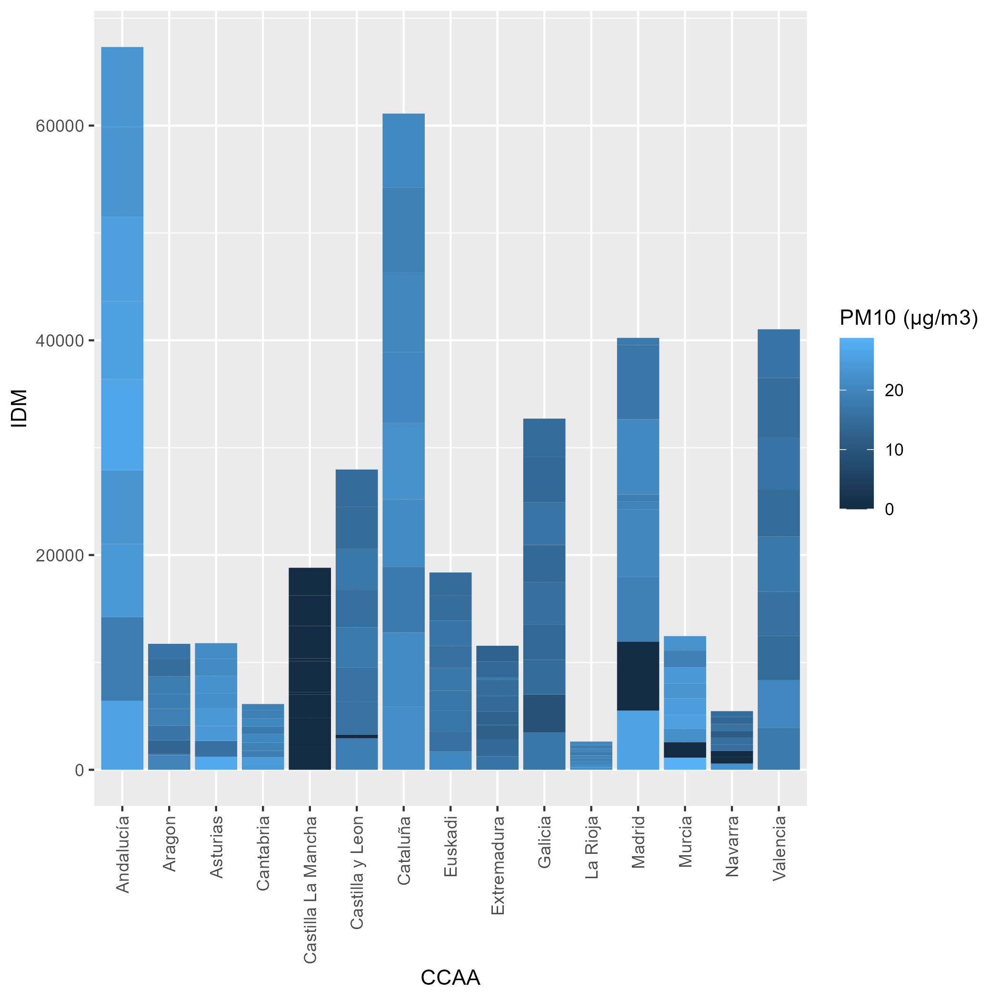

```{r setup, include=FALSE}
knitr::opts_chunk$set(echo = TRUE)
```


## **INTRODUCCIÓN:**
En este seminario se ha recopilado información y llevado a cabo un análisis sobre la calidad del aire en las diferentes comunidades autónomas de España Peninsular y la tasa de muertes por enfermedades respiratorias a lo largo de varios años en dichas regiones.

Finalmente se ha explorado la relación existente entre la calidad del aire y la mencionada tasa de mortalidad.

## **OBJETIVO GENERAL:**
Los objetivos generales de este seminario han sido:

- El estudio de la evolución de las defunciones por comunidades autónomas a lo largo de los años.
- El estudio de la calidad del aire según la concentración de gases obtenida en cada comunidad autónoma y como cambia a lo largo de los años.
- **Objetivo principal:** Analizar y examinar ambos sets de datos y determinar si existe una relación directa entre la calidad del aire que respire la población de cada comunidad autónoma y su tasa de defunción por enfermedades respiratorias.

## **METODOLOGíA :**
### Metodologías del Primer Objetivo General:
- Descargar los archivos en formato .csv que contienen las informaciones de defunciones anuales por Enfermedades Respiratorias para cada Comunidad Autónoma de España Peninsular desde 2010 a 2019. Estas tablas se han obtenido en totalidad a través de la página oficial del INEbase que es el sistema utilizado por el INE (Instituto Nacional de Estadística) para el almacenamiento de la información estadística en Internet. [Enlace directo al recurso utilizado para descargar los archivos](https://www.ine.es/jaxiT3/Tabla.htm?t=10803&L=0)
- Filtrar y cargar los datos para cada Comunidad Autónoma,organizarlos por años y por Comunidades en dataframes para cada año del 2010 al 2019.
- Representar la evolución de la tasa de Mortalidad obtenida en las diferentes Comunidades Autónomas para cada año en unas gráficas distintas del 2010 al 2019.

### Metodologías del Segundo Objetivo General:
- Se ha sacado la tabla principal en formato .xlsx de los datos de Calidad de Aire en España de la página oficial de la OMS [Enlace directo al recurso](https://www.who.int/data/gho/data/themes/air-pollution/who-air-quality-database/2022). Viene representada por Provincias y incluye las medidas de 3 contaminantes .
- Filtar la tabla principal para los datos que solo vienen por España,y luego agrupar los datos dados por Provincias para pasarlos a unas tablas representadas por Comunidades Autónomas.
- Obtener las tablas filtradas y agrupadas por cada Comunidad Autónoma.
- Representar los datos de cada Comunidad Autónoma a lo largo de los años (Del 2010 al 2019).
- Se han buscado otras tablas en distintos formatos(.csv, .xlsx/xls, .ods ) complementarias (por falta y escasez de datos por años y por contaminantes) para incluirlas en el análisis.
Para ello,se han utilizado varias fuentes de datos (Datos Abiertos de España,MITECO,y algunas fuentes y herramientas autonómicas y gubernamentales) [ Datos Abiertos de España](https://datos.gob.es/es/),[MITECO](https://www.miteco.gob.es/es/calidad-y-evaluacion-ambiental/temas/atmosfera-y-calidad-del-aire/calidad-del-aire/evaluacion-datos/redes.html)
- Se procede con lo mismo con las tablas complementarias:limpieza,,cambio de medidas,cambio de sintáxis,selección y filtrado de los datos.

### Metodología del Objetivo General:
- Obtener un tibble (dataframe) filtrado que contenga los datos de la tasa de Mortalidad a nivel de cada Comunidad Autónoma para cada año.
- Obtener un tibble (dataframe) filtrado que contenga los datos de Concentración de los tres Contaminantes para cada año,y para cada contaminante (separados y juntos).
- Combinar los tibbles obtenidos (dataframes) de la Tasa de Mortalidad con su correspondiente para la Concentración de los Contaminantes,y graficar la relación entre ambos. 

## CARGA DE PAQUETES:
```{r,message=FALSE,warning=FALSE}
#PAQUETES A INSTALAR:
library(ggplot2)
library(rjson)
library(readxl)
library(tidyverse)
library(jsonlite)
library(readr)
library(dplyr)
library(readODS)
library(tidyr)
```

```{r, message = FALSE, echo=FALSE}
#CARGA DE DATOS DE DEFUNCIONES DE LAS CCAA QUE EMPIEZAN POR [A,B,C]:

#DATOS DE DEFUNCIONES POR ENFERMEDADES RESPIRATORIAS EN ANDALUCÍA DEL 2007 AL 2021:(NO SE ENCUJENTRAN DATOS JSON):(https://www.ine.es/consul/serie.do?d=true&s=ECM25824)

defunciones_andalucia<- read_delim("DATOS/series-616844354sc_andalucia.csv", 
                                   delim = ";", escape_double = FALSE, trim_ws = TRUE)


#DATOS DE DEFUNCIONES POR ENFERMEDADES RESPIRATORIAS EN ARAGÓN DEL 2007 AL 2021:(https://www.ine.es/consul/serie.do?d=true&s=ECM25823 )
defunciones_aragon<- read_delim("DATOS/series-569481116sc_aragon.csv", 
                                delim = ";", escape_double = FALSE, trim_ws = TRUE)

#DATOS DE DEFUNCIONES POR ENFERMEDADES RESPIRATORIAS EN EL PRINCIPADO DE ASTURIAS DEL 2007 AL 2021:( https://www.ine.es/consul/serie.do?d=true&s=ECM25822 )
defunciones_asturias <- read_delim("DATOS/series-1904166149sc_asturias.csv", 
                                   delim = ";", escape_double = FALSE, trim_ws = TRUE)


#DATOS DE DEFUNCIONES POR ENFERMEMEDADES RESPIRATORIAS EN CANTABRIA DEL 2007 AL 2021:(https://www.ine.es/consuserie.do?d=true&s=ECM25819)
defunciones_cantabria<- read_delim("DATOS/series771112492sc_cantabria.csv", 
                                   delim = ";", escape_double = FALSE, trim_ws = TRUE)


#DATOS DE DEFUNCIONES POR ENFERMEDADES RESPIRATORIAS EN CASTILLA Y LEON DEL 2007 AL 2021: (https://www.ine.es/consul/serie.do?d=true&s=ECM25818)
defunciones_cyl<-read_delim("DATOS/series702246534sc_cyl.csv", 
                            delim = ";", escape_double = FALSE, trim_ws = TRUE)
#DATOS DE DEFUNCIONES POR ENFERMEDADES RESPIRATORIAS EN CASTILLA LA MANCHA DEL 2007 AL 2021:(https://www.ine.es/consul/serie.do?d=true&s=ECM25817)
defunciones_clm<-read_delim("DATOS/series-915120596sc_clm.csv", 
                            delim = ";", escape_double = FALSE, trim_ws = TRUE)
#DATOS DE DEFUNCIONES POR ENFERMEDADES RESPIRATORIAS EN CATALUÑA DEL 2007 AL 2021:(https://www.ine.es/consul/serie.do?d=true&s=ECM25816 )
defunciones_cat<-read_delim("DATOS/series-1419254191sc_cat.csv", 
                            delim = ";", escape_double = FALSE, trim_ws = TRUE)
#DATOS DE DEFUNCIONES POR ENFERMEDADES RESPIRATORIAS EN LA COMUNIDAD VALENCIANA DEL 2007 AL 2021:(https://www.ine.es/consul/serie.do?d=true&s=ECM25815 )
defunciones_vlc<-read_delim("DATOS/series-869225815sc_vlc.csv", 
                            delim = ";", escape_double = FALSE, trim_ws = TRUE)
#DATOS DE DEFUNCIONES POR ENFERMEDADES RESPIRATORIAS EN EXTREMADURA DEL 2007 AL 2021:( https://www.ine.es/consul/serie.do?d=true&s=ECM25814)
defunciones_extremadura<-read_delim("DATOS/series-1186384838t_extremadura.csv", delim = "\t", escape_double = FALSE, trim_ws = TRUE)


#DATOS DE DEFUNCIONES POR ENFERMEDADES RESPIRATORIAS EN GALICIA DEL 2007 AL 2021:(https://www.ine.es/consul/serie.do?d=true&s=ECM25813)
defunciones_gal<-read_delim("DATOS/series386793258sc_gal.csv", 
                            delim = ";", escape_double = FALSE, trim_ws = TRUE)

#DATOS DE DEFUNCIONES POR ENFERMEDADES RESPIRATORIAS EN LA COMUNIDAD DE MADRID DEL 2007 AL 2021:(https://www.ine.es/consul/serie.do?d=true&s=ECM25812 )
defunciones_mad<- read_delim("DATOS/series119180366sc_mad.csv", 
                             delim = ";", escape_double = FALSE, trim_ws = TRUE)

#DATOS DE DEFUNCIONES POR ENFERMEDADES RESPIRATORIAS EN LA REGIÓN DE MURCIA DEL 2007 AL 2021:(https://www.ine.es/consul/serie.do?d=true&s=ECM25811)
defunciones_mrc<-read_delim("DATOS/series-1650015035sc_murcia.csv", 
                            delim = ";", escape_double = FALSE, trim_ws = TRUE)
#DATOS DE DEFUNCIONES POR ENFERMEDADES RESPIRATORIAS EN LA COMUNIDAD FORAL DE NAVARRA DEL 2007 AL 2021:(https://www.ine.es/consul/serie.do?d=true&s=ECM25810)
defunciones_nvr<-read_delim("DATOS/series-1724737377sc_nvr.csv", 
                            delim = ";", escape_double = FALSE, trim_ws = TRUE)
#DATOS DE DEFEUNCIONES POR ENFERMEDADES RESPIRATORIAS EN EL PAÍS VASCO DEL 2007 AL 2021:(https://www.ine.es/consul/serie.do?d=true&s=ECM25809)
defunciones_euskadi<- read_delim("DATOS/series137774152sc_euskadi.csv", 
                                  delim = ";", escape_double = FALSE, trim_ws = TRUE)

#DATOS DE DEFUNCIONES POR ENFERMEDADES RESPIRATORIAS EN LA RIOJA DEL 2007 AL 2021:(https://www.ine.es/consul/serie.do?d=true&s=ECM25808)
defunciones_rioja<-read_delim("DATOS/series-573723813sc_rioja.csv", 
                              delim = ";", escape_double = FALSE, trim_ws = TRUE)

  
  
#HASTA AQUI SE HAN CARGADO TODOS LOS DATOS DE DEFUNCIONES EN FORMATO CSV POR ENF.RESP EN TODAS LAS CCAA DE ESPAÑA SALVO LAS 2 CUIDADES AUTÓNOMAS DE CEUTA Y MELILLA
#TRATAMIENTO DE LAS TABLAS Y GRÁFICAS:
andalucia_data<-
  defunciones_andalucia %>% 
  select(.data=.,Valor3,Valor5,PERIODO,VALOR) %>% 
  rename(.data=.,CCAA=Valor3,CausadeMuerte=Valor5,Year=PERIODO,IDM=VALOR)

andalucia_data
#DATOS LIMPIADOS PARA ARÁGON:
aragon_data<-
  defunciones_aragon %>% 
  select(.data=.,Valor3,Valor5,PERIODO,VALOR) %>% 
  rename(.data=.,CCAA=Valor3,CausadeMuerte=Valor5,Year=PERIODO,IDM=VALOR)

#DATOS LIMPIADOS PARA ASTURIAS:
asturias_data<-
  defunciones_asturias %>% 
  select(.data=.,Valor3,Valor5,PERIODO,VALOR) %>% 
  rename(.data=.,CCAA=Valor3,CausadeMuerte=Valor5,Year=PERIODO,IDM=VALOR)


#DATOS LIMPIADOS PARA CANTABRIA
cantabria_data<-
  defunciones_cantabria %>% 
  select(.data=.,Valor3,Valor5,PERIODO,VALOR) %>% 
  rename(.data=.,CCAA=Valor3,CausadeMuerte=Valor5,Year=PERIODO,IDM=VALOR)

#DATOS LIMPIADOS PARA CATALUÑA
cat_data<-
  defunciones_cat %>% 
  select(.data=.,Valor3,Valor5,PERIODO,VALOR) %>% 
  rename(.data=.,CCAA=Valor3,CausadeMuerte=Valor5,Year=PERIODO,IDM=VALOR)

#DATOS LIMPIADOS PARA CASTILLA LA MANCHA
clm_data<-
  defunciones_clm %>% 
  select(.data=.,Valor3,Valor5,PERIODO,VALOR) %>% 
  rename(.data=.,CCAA=Valor3,CausadeMuerte=Valor5,Year=PERIODO,IDM=VALOR)

#DATOS LIMPIADOS PARA CYL
cyl_data<-
  defunciones_cyl %>% 
  select(.data=.,Valor3,Valor5,PERIODO,VALOR) %>% 
  rename(.data=.,CCAA=Valor3,CausadeMuerte=Valor5,Year=PERIODO,IDM=VALOR)

#DATOS LIMPIADOS PARA PAÍS VASCO
euskadi_data<-
  defunciones_euskadi %>% 
  select(.data=.,Valor3,Valor5,PERIODO,VALOR) %>% 
  rename(.data=.,CCAA=Valor3,CausadeMuerte=Valor5,Year=PERIODO,IDM=VALOR)

#DATOS LIMPIADOS EXTREMADURA
extremadura_data<-
  defunciones_extremadura %>% 
  select(.data=.,Valor3,Valor5,PERIODO,VALOR) %>% 
  rename(.data=.,CCAA=Valor3,CausadeMuerte=Valor5,Year=PERIODO,IDM=VALOR)

#DATOS LIMPIADOS GALICIA
gal_data<-
  defunciones_gal %>% 
  select(.data=.,Valor3,Valor5,PERIODO,VALOR) %>% 
  rename(.data=.,CCAA=Valor3,CausadeMuerte=Valor5,Year=PERIODO,IDM=VALOR)

#DATOS LIMPIADOS MADRID
mad_data<-
  defunciones_mad %>% 
  select(.data=.,Valor3,Valor5,PERIODO,VALOR) %>% 
  rename(.data=.,CCAA=Valor3,CausadeMuerte=Valor5,Year=PERIODO,IDM=VALOR)

#DATOS LIMPIADOS REGION DE MURCIA
mrc_data<-
  defunciones_mrc %>% 
  select(.data=.,Valor3,Valor5,PERIODO,VALOR) %>% 
  rename(.data=.,CCAA=Valor3,CausadeMuerte=Valor5,Year=PERIODO,IDM=VALOR)


#DATOS LIMPIADOS NAVARRA:
nvr_data<-
  defunciones_nvr %>% 
  select(.data=.,Valor3,Valor5,PERIODO,VALOR) %>% 
  rename(.data=.,CCAA=Valor3,CausadeMuerte=Valor5,Year=PERIODO,IDM=VALOR)

#DATOS LIMPIADOS RIOJA
rioja_data<-
  defunciones_rioja %>% 
  select(.data=.,Valor3,Valor5,PERIODO,VALOR) %>% 
  rename(.data=.,CCAA=Valor3,CausadeMuerte=Valor5,Year=PERIODO,IDM=VALOR)

#DATOS LIMPIADOS C.VALENCIANA

vlc_datos<-
  defunciones_vlc %>% 
  select(.data=.,Valor3,Valor5,PERIODO,VALOR) %>% 
  rename(.data=.,CCAA=Valor3,CausadeMuerte=Valor5,Year=PERIODO,IDM=VALOR)

#HASTA AQUI SE HAN LIMPIADO TODAS LAS TABLAS DE DEFUNCIONES QUE VIENEN PARA CADA CCAA EXCEPTO LAS 2 CUIDADES AUTONOMAS DE CEUTA Y MELILLA

#SE VAN A JUNTAR TODAS LA TABLAS (UNION)  DE DEFUNCIONES PARA TODAS LAS CCAA PARA MOSTRARLAS EN UN UNICA TABLA:
#SE DEBEN REVISAR LOS DATOS PARA QUITAR LOS SEPARADORES DE MILES DE LOS MILES PORQUE CREARAN PROBLEMAS A LA HORA DE JUNTARLOS 
#PARA QUE LOS DATOS SEAN COHERENTES,TENEMOS QUE CAMBIAR LOS DATOS QUE VIENEN SEPARADOS POR PUNTOS,LO CONSIDERAREMOS COMO MILES Y NO COMO INDICES COMO NO TENEMOS INDICADORES DEL CONTRARIO:

vlc_rec<-
  vlc_datos %>%
  mutate(IDM=as.numeric(gsub("\\.","",IDM)))

#tabla andalucia sin separador de miles:

andalucia_rec<-
  andalucia_data %>%
  mutate(IDM=as.numeric(gsub("\\.","",IDM)))

#tabla aragon sin separador de miles:

aragon_rec<-
  aragon_data %>% 
  mutate(IDM=as.numeric(gsub("\\.","",IDM)))

#tabla asturias sin separador de miles

asturias_rec<-
  asturias_data %>% 
  mutate(IDM=as.numeric(gsub("\\.","",IDM)))


#tabla cataluña sin separador de miles:
cat_rec<-
  cat_data %>% 
  mutate(IDM=as.numeric(gsub("\\.","",IDM)))

#tabla la mancha sin separador de miles:
clm_rec<-
  clm_data %>% 
  mutate(IDM=as.numeric(gsub("\\.","",IDM)))

#tabla cyl sin separador de miles:
cyl_rec<-
  cyl_data %>%
  mutate(IDM=as.numeric(gsub("\\.","",IDM)))

#tabla euskadi sin separador de miles:
euskadi_rec<-
  euskadi_data %>%
  mutate(IDM=as.numeric(gsub("\\.","",IDM)))


#tabla extremadura sin separador de miles:
extremadura_rec<-
  extremadura_data %>% 
  mutate(IDM=as.numeric(gsub("\\.","",IDM)))


#tabla galicia sin separador de miles:
gal_rec<-
  gal_data %>%
  mutate(IDM=as.numeric(gsub("\\.","",IDM)))

#tabla madrid sin separador de miles:

mad_rec<-
  mad_data %>%
  mutate(IDM=as.numeric(gsub("\\.","",IDM)))

#tabla murcia sin separador de miles:

mrc_rec<-
  mrc_data %>%
  mutate(IDM=as.numeric(gsub("\\.","",IDM)))

#FIN DE RECTIFICACION DE LAS TABLAS DE DEFUNCIONES  (ELIMINACION DE SEPARADOR DE MILES POR LAS TABLAS QUE LAS CONTENGAN) :

#LA TABLA SIGUIENTE CONTIENE TODOS LOS DATOS DE DEFUNCIONES PARA CADA CCAA EN EL PERIODO DE 2007 HASTA 2021:(UNION DE LAS TABLAS):
total_defunciones_CCAA<-
  rbind(andalucia_rec,aragon_rec,asturias_rec,cantabria_data,cat_rec,clm_rec,cyl_rec,euskadi_rec,extremadura_rec,gal_rec,mad_rec,mrc_rec,nvr_data,rioja_data,vlc_rec) %>% 
  arrange(.data=.,desc(IDM))

knitr::kable(total_defunciones_CCAA)
```

```{r, echo=FALSE}
htmltools::img(src = knitr::image_uri("Escudo Color TC.png"), 
               alt = 'logo', 
               style = 'position:absolute; top:0; left:0; padding:10px; width:100px; height:100px;')
```

## RELACIONES Y CONCLUSIONES:
### NIVELES DE PM10 POR CCAA A LO LARGO DE LOS AÑOS:
```{r , echo=FALSE, fig.cap="A caption", out.width = '100%'}

```

### NIVELES DE PM2.5 POR CCAA A LO LARGO DE LOS AÑOS:
```{r , echo=FALSE, fig.cap="A caption", out.width = '100%'}

```

### NIVELES DE NO2 POR CCAA A LO LARGO DE LOS AÑOS:
```{r, echo=FALSE, fig.cap="A caption", out.width = '100%'}

```


### GRAFICO NO2 JUNTO DEFUNCIONES PARA TODAS LAS CCAA

```{r, echo=FALSE, fig.cap="A caption", out.width = '100%'}

```

### GRAFICO PM2.5 JUNTO DEFUNCIONES PARA TODAS LAS CCAA

```{r, echo=FALSE, fig.cap="A caption", out.width = '100%'}

```


### GRAFICO PM10 JUNTO DEFUNCIONES PARA TODAS LAS CCAA

```{r, echo=FALSE, fig.cap="A caption", out.width = '100%'}

```